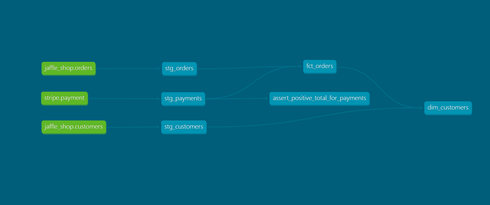
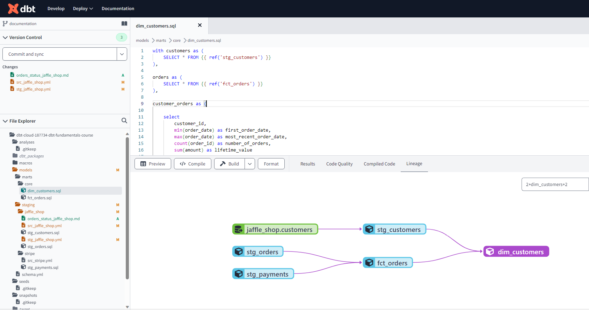

# Welcome to Your New dbt Project!

## Getting Started with the Starter Project

To get your dbt project started, run these commands:

```bash
dbt run
dbt test
```

<p align="center">
  
</p>
<p align="center">
  
</p>


## Resources

Here are some resources to help you get the most out of dbt:

- **dbt Events**: Find [dbt events near you](https://events.getdbt.com).
- **The Blog**: Check out [the blog](https://blog.getdbt.com/) for the latest on dbt's development and best practices.
- **dbt Docs**: Learn more about dbt [in the docs](https://docs.getdbt.com/docs/introduction).
- **Discourse**: Visit [Discourse](https://discourse.getdbt.com/) for commonly asked questions and answers.
- **dbt Community**: Join the [dbt community](http://community.getdbt.com/) to connect with other analytics engineers.
